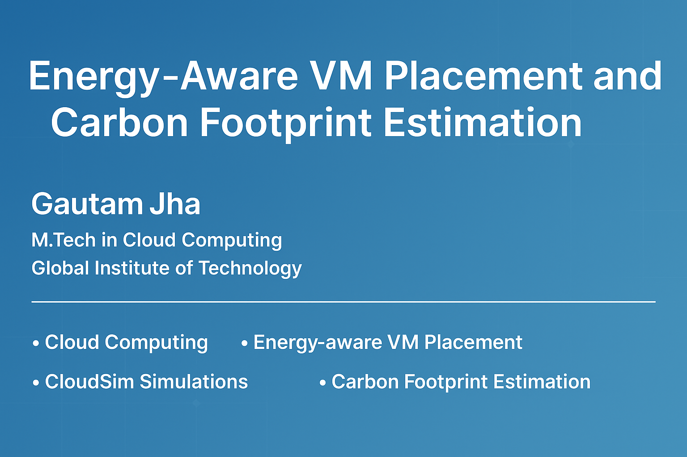

# Energy-Aware VM Placement & Carbon Footprint Estimation

This project is part of my M.Tech thesis (2025) at **Global Institute of Technology**. It proposes intelligent strategies for energy-aware virtual machine placement and real-time carbon emission tracking in cloud environments.

---

## 🎯 Objectives

- Reduce power usage in cloud data centers
- Minimize SLA violations through optimized VM allocation
- Estimate the carbon footprint of cloud workloads
- Provide real-time developer feedback on emissions

---

## 🧪 Tools & Technologies

- **CloudSim Plus**
- **Java, Python**
- **Optimization Algorithms**: GA, PSO, ACO
- **Zenodo**, **GitHub**, **GitHub Actions**

---

## 📊 Project Structure

- `/docs`: Thesis chapters
- `/code`: CloudSim implementations
- `/results`: Output data & graphs
- `/tools`: Optional dashboards

---

## 📄 Citation

DOI: [10.5281/zenodo.15865931](https://doi.org/10.5281/zenodo.15865931)

```bibtex
@misc{jha2025vmplacement,
  author       = {Gautam Jha},
  title        = {Energy-Aware VM Placement and Carbon Footprint Estimation},
  year         = 2025,
  publisher    = {Zenodo},
  doi          = {10.5281/zenodo.15865931}
}
```

---

## 👨‍🎓 Author

**Gautam Jha**  
M.Tech in Cloud Computing  
📍 Global Institute of Technology  
📧 infojhagautam@gmail.com  
